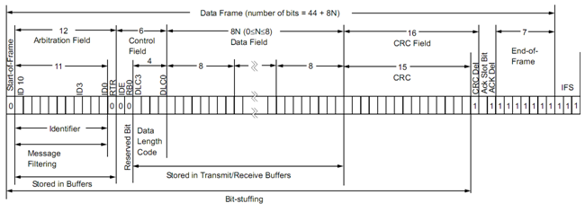

TRON 3TB4 Summary
=================

* Instructor: Dr. Lawford 
* *Winter 2015*
* McMaster University
* *Primary Author*: Kemal Ahmed
> Written with [StackEdit](https://stackedit.io/).

##CanBUS

> Controller Area Network

* 2-wire protocol: `CAN_H` and `CAN_L` that allows microcontrollers and devices to communicate without a host computer
* uses <ins>constructive arbitration</ins>
	*  Since 2 wires travel the same length, they experience the same external noise, so you can just remove the noise 
* When both lines have same voltage, signal is *recessive*
* If `CAN_H` - `CAN_L` > 0.9V, signal is *dominant*
* No ground reference, i.e. no ground noise
* Maximum transmission rate: 1 Megabit / s
* Each device has its own priority
  * If the controller is busy when a signal has been sent to it, it will be delayed until it has the highest priority

##Bit Stuffing
> Inserting extra non-data bits into data signals. The extra bits are removed upon being received.
 
This is important for increasing bit rates when they're too slow 

####RZ
> **Return to Zero mode**:
> Pulses will always return to 0 even if there are consecutive pulses. 

The signal is bit-stuffed with 0's


####NRZ
> **Non-Return to Zero mode**:
> Pulses will never return to 0

The signal is bit-stuffed to keep its value, until the next pulse


###Manchester Coding
> A.K.A. **Phase encoding**

**Biphase Manchester**:

###Dominant and Recessive Signals

If you have multiple signals, the **dominant** signal will change everything and the **recessive** signal won't.

> **Think**
> : *What will be the output when both values are prevalent?* A good example when trying to conceptualize this is an `AND` gate. When one signal is `0` and the other is `1`, what will...*dominate*? The `0`.
> 
> : This can be extended to when you have multiple devices in series with the same power usage...won't change voltage 

---------------------

**Ethernet** uses <ins>destructive conflict resolution</ins>.

**Prototols**: how to interpret/represent a set of inputs

**Slew Rate**: rate of change of voltage / s; how jagged are your square waves?

**Baud Rate**: number of signals; 1/period

RTR remote messages

**Arbitration**: when you are trying to send multiple signals along the same wire and you need to figure out which one will go first, you choose the smallest one (i.e. 1011 before 1100)

**Differential BUS**: when 2 wires travel along the same path, they experience the same external interference. To determine the message, you need to find the difference between the 2 wires, so you actually end up subtracting out the interference



Each CANBUS Node has:

* **Host processor**: generates messages to be sent; deciphers received messages
* **CAN Controller**: takes messages from host and transmits them to the bus
* **Transceiver**:

**Start Of Message (SOM) Bit**:

**Polling**: 

* **Normal mode**: 
* **Loopback mode**: sends TX from controller to RX; don't need acknowledgements
* **Silent mode**: sends RX to TX; more checking if messages are spam
* **Silent-loopback mode**: 

----

Message filtering:

* Software

**ElectroMagnetic Interference (EMI)**:


##Verilog

####Initial Block
: Executed only once, providing initial values for system

####Always Block
: A block wired non-sequentially
> * Infinitely repeated concurrently
> * Can only have one always block
> * Assignments can only be done to registers
> * Last statement has the highest <ins>priority</ins>

What is meant by priority:

	x = 0
	x = 4
	x = 3
	print x
	 3

####Blocking assignment
: A block of code where statements *block* the execution of the following statement(s)
> First statement must complete before the second statement
> Identify in this format:
	> ```
	> begin
	> <statements>;
	> end
	> ```

####Number Representation

`<number of bits>b<value with minimal prior 0s>`

> e.g.
> `8b1`: 00000001

##Wiring Diagrams

* Intermediate wires are given arbitrary names
* The number of bits transmitted on each wire is labelled on each wire

##Asynchronous Systems
> A system that does not reset depending on the clock

**Posedge**: 1 = high

**Negedge**: 1 = low 

##Timing Diagrams

###Hints

* Make sure you put a small delay

##FPD
: *Field Programmable Device*

**Standard Chip**: inefficient

###PLD
: *A Programable Logic Device is a collection of programmable switches and general structures*

e.g. EEPROM, PAL, PLA, CPLD, FPGA


####Macrocell
: *Extra circuitry after PAL and PLA circuits*

####CPLDs
: *Complex Programmable Logic Device is several PAL / PLAs in series*

####FPGA
: *Field Programmable Gate Arrays can be re-programmed after they've been deployed*

1. Calculate result and save
2. Use inputs to select the result from table